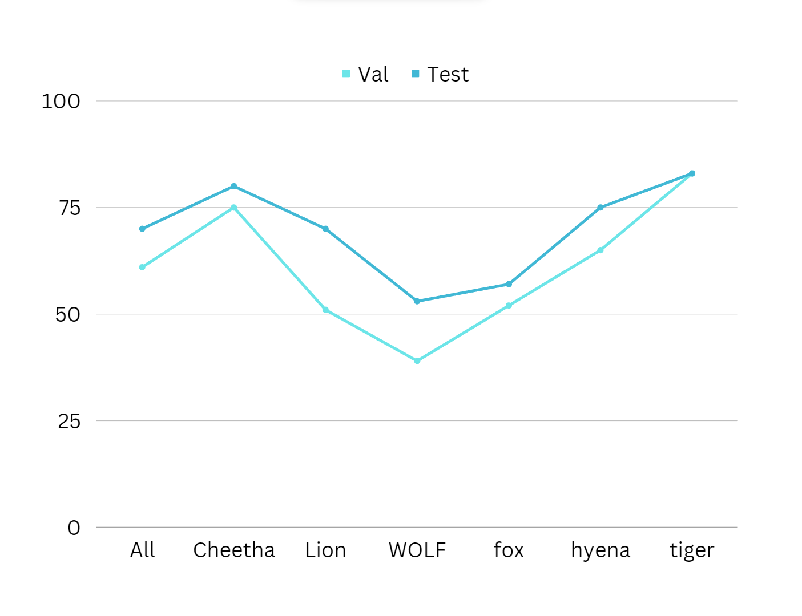

# Unkils_HackVengers
project Submission of Hackvengers Hackathon
# Wild-Animal-Detection


https://user-images.githubusercontent.com/88922616/224906760-3b4222e0-e67c-43f0-86f8-fa858945df0e.mp4


https://user-images.githubusercontent.com/88922616/224907446-1bd80ca0-1345-4b5c-8fab-cd7e772195ad.mp4


## After That you are curious about Project 


<!-- ABOUT THE PROJECT -->
## About The Project
We made a custom object detection model accuracy of 70% and And came up with an Interface that detects Wild animals  from webcam feed, images, and URLs of images   

### Built With

* yolov5s, yolov8
* roboflow


<!-- GETTING STARTED -->
## Getting Started

we used google colab to run our yolov5 model to run it with gpu

### Prerequisites

* python
* roboflow

### Data Anatoation


### Installation

1. Clone the repo
   ```sh
   git clone https://github.com/ultralytics/yolov5.git
   ```
2. Install required dependensies
   ```sh
   pip install -r requirements.txt
   ```
4. Enter your roboflow API of your custom dataset
   ```js
   const API_KEY = 'ENTER YOUR API';
   ```


## Accurecy
I know you, curious about accurecy Here's Accurecy



<!-- USAGE EXAMPLES -->
## Usage

* We will implement this model in all the villages around the jungle areas. The highways pass threw jungle areas and in the jungles.


<!-- LICENSE -->
## License

Distributed under the MIT License. See `LICENSE` for more information.


<!-- ACKNOWLEDGEMENTS -->
## Acknowledgements
* [Ultralytics/yolov5](https://github.com/ultralytics/yolov5)
* [Roboflow](https://roboflow.com/)
